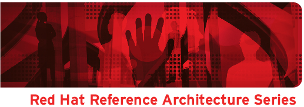

= High Availability Network Architecture: with Red Hat Enterprise Linux OpenStack Platform 7
Dan Sneddon <dnseddon@redhat.com>
v1.0, October 13, 2015
:description: Reference architecture
:doctype: book
:title-logo-image: 
// Settings:
:experimental:
:listing-caption: Listing
:icons: font
:toc:
:toclevels: 3
:cdn: Red Hat Content Delivery Network
:eap: Red Hat JBoss Enterprise Application Platform
:eapver: Red Hat JBoss Enterprise Application Platform 6
:osp: Red Hat Enterprise Linux OpenStack Platform
:ospver: Red Hat Enterprise Linux OpenStack Platform 7
:rhel: Red Hat Enterprise Linux
:rhss: Red Hat Satellite Server
:ro: RHEL-OSP
ifdef::backend-pdf[]
:pagenums:
:pygments-style: bw
:source-highlighter: pygments
:autofit-option:
endif::[]

<<<

100 East Davie Street +
Raleigh NC 27601 USA +
Phone: +1 919 754 3700 +
Phone: 888 733 4281 +
Fax: +1 919 754 3701 +
PO Box 13588 +
Research Triangle Park NC 27709 USA +

Linux is a registered trademark of Linus Torvalds. Red Hat, Red Hat Enterprise Linux and the Red Hat "Shadowman" logo are registered trademarks of Red Hat, Inc. in the United States and other countries.
Microsoft and Windows are U.S. registered trademarks of Microsoft Corporation.
UNIX is a registered trademark of The Open Group.
Intel, the Intel logo and Xeon are registered trademarks of Intel
Corporation or its subsidiaries in the United States and other
countries. OpenStack is the trademark of the OpenStack Foundation.
All other trademarks referenced herein are the property of their respective owners.

© 2015 by Red Hat, Inc. This material may be distributed only subject to the terms and conditions set forth in the Open Publication License, V1.0 or later (the latest version is presently available at http://www.opencontent.org/openpub/).

The information contained herein is subject to change without notice. Red Hat, Inc. shall not be liable for technical or editorial errors or omissions contained herein.

Distribution of modified versions of this document is prohibited without the explicit permission of Red Hat Inc.

Distribution of this work or derivative of this work in any standard (paper) book form for commercial purposes is prohibited unless prior permission is obtained from Red Hat Inc.

The GPG fingerprint of the security@redhat.com key is:
CA 20 86 86 2B D6 9D FC 65 F6 EC C4 21 91 80 CD DB 42 A6 0E

Send feedback to refarch-feedback@redhat.com

<<<

include::doc/commentsfeedback.adoc[]
include::doc/ra_ospnet_ch1_execsummary.adoc[]
include::doc/ra_ospnet_ch2_overview.adoc[]
include::doc/ra_ospnet_ch3_netha.adoc[]
include::doc/ra_ospnet_ch4_overcloud.adoc[]
include::doc/ra_ospnet_ch5_neutron.adoc[]
include::doc/ra_ospnet_ch6_netts.adoc[]
include::doc/ra_ospnet_ch7_appendices.adoc[]

// vim: set syntax=asciidoc
